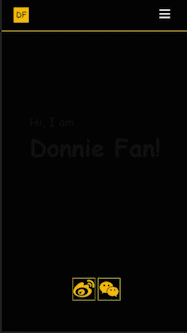
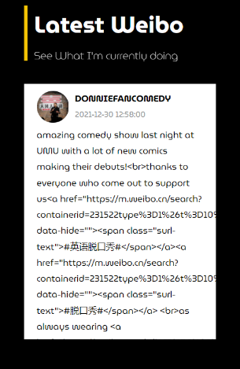
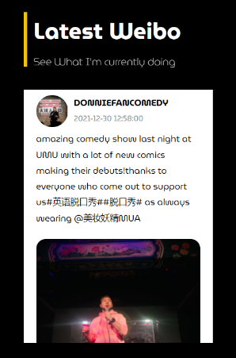
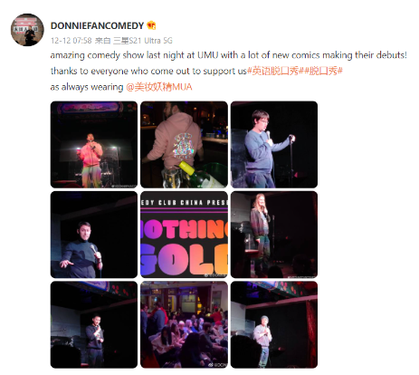
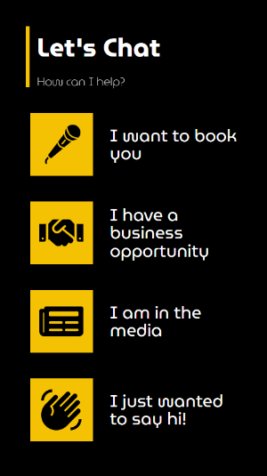
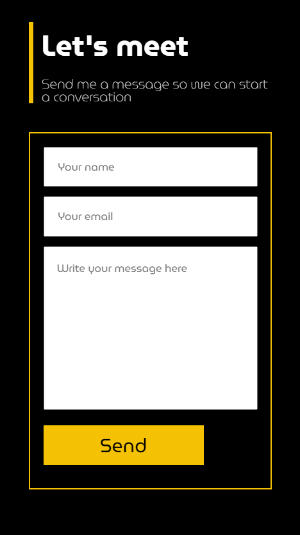
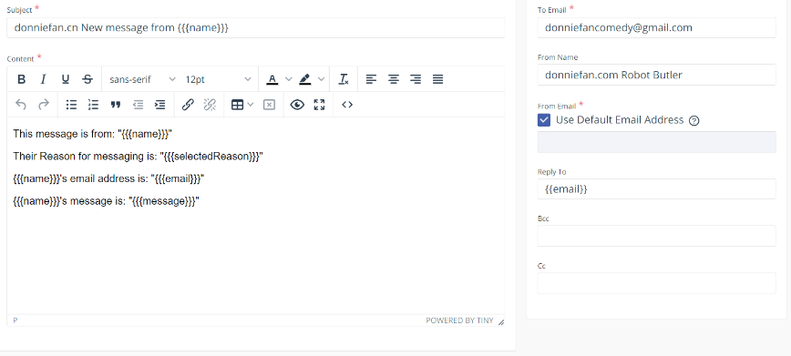
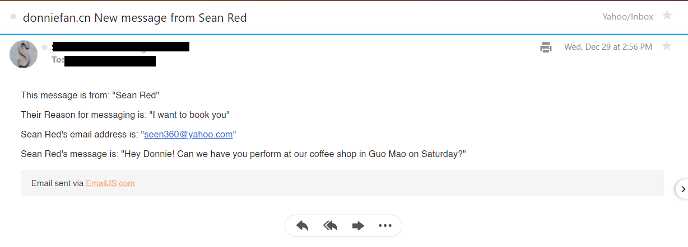

# donniefan.com

This is a website for the China based comedian Donnie Fan.

## Table of contents

- [Overview](#overview)
  - [User Stories](#user-stories)
  - [Screenshot](#screenshot)
  - [Links](#links)
- [My process](#my-process)
  - [Built with](#built-with)
  - [What I learned](#what-i-learned)
  - [Continued development](#continued-development)
- [Author](#author)

## Overview

### User Stories

Users should be able to:

- Find Donnie Fan on popular Chinese social media such as Weibo and Wechat.
- Send Donnie a direct message for bookings or business related reasons.
- View the website on desktop, tablet or mobile. Especially mobile, as most Chinese users are mobile users.
- Watch video clips of Donnie's stand up comedy
- See Donnie's latest Weibo posts.
- See where Donnie is performing and when.
- Load the site quickly and not have the site blocked in China.

### Screenshots




### Links

- GitHub URL: [https://github.com/seanred360/donnie-fan-website]
- Live Site URL: [https://donniefan.com]

## My process

### Built with

- [React](https://reactjs.org/) - JS library
- [React Router](https://reactrouter.com/) - For routing a multi page app
- [react-icons](https://react-icons.github.io/react-icons/) - For icons as React components
- [Netlify](https://www.netlify.com) - For hosting
- [SASS](https://sass-lang.com/) - For styles
- [EmailJS](https://emailjs.com) - Backend for handling emails on the contact form
- [Weibo to RSS](https://github.com/zgq354/weibo-rss)
- [rss to json](https://rss2json.com/)
- [React functionals components and hooks] - I moved away from the class based component workflow.

This is my first paid gig.

#### Creating a custom Weibo feed


Unfortunantly, Weibo doesn't have a premade feed that can be easily embedded like Twitter does. Weibo also doesn't issue API keys freely to most developers. I searched and searched around the English and Chinese internet for solutions that other people came up with. Sadly every solution that Chinese developers had on Github or other places got patched by Weibo and no longer work. So the solution I came up with was to generate an RSS feed from Donnie's Weibo (also not supported by Weibo).

- [Weibo to RSS](https://github.com/zgq354/weibo-rss) - (Chinese language only) Can generate an RSS link from Weibo in XML
- [Live instance](https://rssfeed.today/weibo/)

```html
<?xml version="1.0" encoding="UTF-8"?>
<rss
	xmlns:dc="http://purl.org/dc/elements/1.1/"
	xmlns:content="http://purl.org/rss/1.0/modules/content/"
	xmlns:atom="http://www.w3.org/2005/Atom" version="2.0">
	<channel>
		<title>
			<![CDATA[DONNIEFANCOMEDY的微博]]>
		</title>
		<description>
			<![CDATA[english/chinese comedian Donnie Fan]]>
		</description>
		<link>https://weibo.com/7708697903</link>
		<generator>https://github.com/zgq354/weibo-rss</generator>
		<lastBuildDate>Thu, 23 Dec 2021 13:48:17 GMT</lastBuildDate>
		<ttl>15</ttl>
		<item>
```

Ok so I have XML data from Donnie's Weibo, but JSON would be easier to work with. For this I found "rss to json".

- [rss to json](https://rss2json.com/) An API maintained by Molayi that converts RSS to JSON. This generates JSON from the RSS link I generated earlier. When Donnie makes a post on Weibo, the RSS link passes the data to this converter automatically.

```js
{
"status": "ok"
"feed": {
"url": "https://rssfeed.today/weibo/rss/7708697903"
"title": "DONNIEFANCOMEDY的微博"
"link": "https://weibo.com/7708697903"
"author": ""
"description": "english/chinese comedian Donnie Fan"
"image": ""
}
```

The next step was to load the JSON data with axios and the generated URL and save it in a variable.

```js
const [socialMediaData, setSocialMediaData] = useState({});

const { response, loading, error } = useAxios({
  method: "get",
  url: "https://api.rss2json.com/v1/api.json?rss_url=https%3A%2F%2Frssfeed.today%2Fweibo%2Frss%2F7708697903",
});

useEffect(() => {
  if (response !== null) {
    setSocialMediaData(response);
  }
}, [response]);
```

Next I recreated and styled my own custom Weibo feed to resemble the real Weibo and rendered the data.



The trouble was, the JSON data was littered with HTML tags. To solve this I came up with a very long regex to remove all the HTML tags while preserving the content

```js
<div className="__post-content">
                <span className="__content-text">
                  {post["content"]
                    .replace(/<a\b[^>]*>/gm, "")
                    .replace(/<\/a>/gm, "")
                    .replace(/]*>/gm, "")
                    .replace(/<\/img>/gm, "")
                    .replace(/<br\b[^>]*>/gm, "")
                    .replace(/<\/br>/gm, "")
                    .replace(/<span\b[^>]*>/gm, "")
                    .replace(/<\/span>/gm, "")}
                </span>
```

I was very satisfied with the results, and impressed with myself.




Finally I bought a domain name and threw the site up live on Netlify. I was very excited to share the results with my client. Sadly I was not done yet. The images in the feed were not loading on the live site. I was a little frusterated because they worked in the local development server and on Postman. After doing some digging, I found that all the images from Donnie's Weibo had a 403 access denied error. Weibo was blocking my hotlinking! In the network tab I found the error "x-tengine-error: denied by Referer ACL". I searched the Chinese internet and found that this is a setting Tencent and Alibaba cloud use to stop hotlinkers like myself. For many hours I believed that my efforts had all been foiled by Weibo. After reading the documentation for Alibaba cloud, I learned that whoever owns a server can create a whitelist of Referers. There was an option to whitelist empty or missing Referer headers. So I went into my index.html and removed the Referer header and....... IT WORKED! Weibo blocks all Referers that aren't Weibo.com, BUT they whitelist missing Referer headers. SUCCESS!

#### Creating a contact form without a backend




The client wanted to receive messages by email. While I have some basic knowledge of creating a backend with Node and Express. I thought it would be overkill to create an entire backend to serve this mostly static site. The solution was to let EmailJS handle the form data and email it to my client. I setup an account and created the component. The name, email, message, and reason get filtered into a template and sent in a readable format to the clients gmail account.

```html
<form className="__contact-form" onSubmit="{sendEmail}">
  <input
    type="text"
    className="--option-input"
    name="selectedReason"
    defaultValue="{selectedReason}"
  />
  <input
    type="text"
    className="--name-input"
    name="name"
    placeholder="Your name"
  />
  <input
    type="email"
    className="--email-input"
    name="email"
    placeholder="Your email"
  />
  <textarea
    type="text"
    className="--message-input"
    name="message"
    placeholder="Write your message here"
  />
  <input type="submit" className="--send-message" value="Send" />
</form>
```

```js
const [selectedReason, setSelectedReason] = useState(null);
const [mailSent, setMailSent] = useState(false);
const [error, setError] = useState(null);

useEffect(() => {
  if (selectedReason && contactForm.current) {
    contactForm.current.scrollIntoView({
      behavior: "smooth",
    });
  }
}, [selectedReason]);

const sendEmail = (event) => {
  event.preventDefault();

  emailjs
    .sendForm(
      "DonnieFanGmailService",
      "DonnieFanEmailTemplate",
      event.target,
      "user_aHJJrmyRNc0qGAYv0sKKe"
    )
    .then(
      (result) => {
        setMailSent(true);
      },
      (error) => {
        setError(error);
      }
    );
};
```




### Continued development

In the future Donnie wants to have his photography, theatre plays, and other portfolio items on the site. When Donnie's brand grows we will apply for a .cn domain name with the Chinese government and add an English/Chinese language swap button. We can then host on Alibaba cloud or 21Yunbox for faster load times and a guarantee that the site is never blocked. I did not feel that Chinese localization was needed yet. Donnie does speak and perform in Chinese, but his main audience are expats and Chinese people that speak English.

## Author

- Website - [seanred.io](https://seanred.io)
- GitHub - [https://github.com/seanred360](https://github.com/seanred360)
